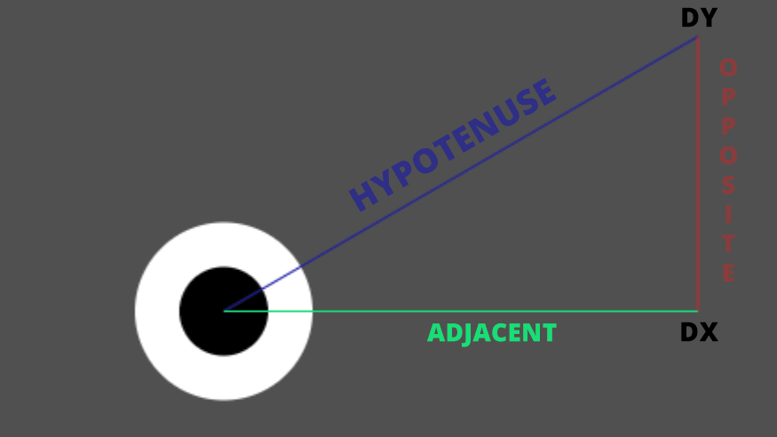

I wasn't the greatest fan of maths back in school. Beyond basic arithmetic I couldn't see when I'd ever need to use the subjects they taught in real life.

I got by like that for a long time, even when I changed career, learning to program as a front-end developer. It's not like you use much linear algebra or trigonometry when creating user interfaces in React.

As I started to take on creative coding projects and XR development though, I soon changed my tune and started to learn to love math because I finally saw a practical application for it.

The more I discover, the more fun I tend to have when coding interactive experiences and so I've decided to start sharing what I learn to reinforce it and act as a reference for future me who's bound to forget stuff.

In this post I'm sharing some simple trigonometry techniques that have proved useful on several occasions. To do so we'll create a little demo of an eye-ball that looks at your cursor as you move it around the screen.


## Canvas Set-up

https://codepen.io/adammarcwilliams/pen/mvdQyG
We start with a simple canvas set-up with a draw loop that gets fired on a request animation frame, a `handleMouseMove` listener to track the mouse coordinates and a `handleResize` listener to keep the demo responsive.

Then inside the draw loop we define two objects, one for the eye and one for it's pupil. These both have an x and y coordinate and a radius.

``` javascript
const eye = {
  x: width / 2,
  y: height / 2,
  radius: 50
};

const pupil = {
  x: eye.x,
  y: eye.y,
  radius: eye.radius / 2
};
```

For the eyes coordinates I've used the center of the screen and a radius of 50. The pupil uses the same coordinates as the eye (for now) and half the eyes radius.

We then draw them to the screen using the canvas arc function, making the eye white and the pupil black.

Try playing with the pupils coordinates a little by adding 20px to the pupils x coordinate and 15px to its y.

``` javascript
const pupil = {
  x: eye.x + 20,
  y: eye.y + 10,
  radius: eye.radius / 2
};
```

See how it's looking down to the right now? 

It's by adding and subtracting small amounts to the pupils x and y coordinates that we can control the direction the eye appears to look.

But how do we know what numbers to use?


## Rolling the Eyes - Sine & Cosine

https://codepen.io/adammarcwilliams/pen/jdOeZJ
Turns out we can use a couple of trigonometric functions called sine and cosine to work out what numbers we'll need to roll our eyes around in a circle.

These functions take an angle and return a value between -1 to 1 and when used together can plot a point around a unit circle.

[](https://commons.wikimedia.org/wiki/File:Circle_cos_sin.gif)

This is a common pattern you'll use whenever you want to rotate anything in a circle around a center point and it looks like this.

``` javascript
x = center.x + Math.cos(angle) * offset
y = center.y + Math.sin(angle) * offset
```

Given the angle that's passed in it will give you the position needed to plot that angle around a circle using the offset to determine how far away from the center it should be.


A couple of things to note is that the angle you pass in is in radians, not degrees. This is easy to convert back and forth:

```javascript
radians = degrees * Math.PI / 180
degrees = radians * 180 / Math.PI
```

Also the circle starts at 3 o'clock not the top. In canvas it travels clockwise as you may expect but in math traditionally and in other libraries like three.js it will travel anti-clockwise.

Lastly it's common to see angles stored using the name `theta` which is what I've done in our demo and I'm incrementing it at the end of each draw loop to make the eye roll for now.


## Follow the Cursor - Solving for Triangles

https://codepen.io/adammarcwilliams/pen/yZLQOe
Now we have a system to make the eye look in any direction given an angle, we need to work out what angle to feed it to follow our cursor.

To work this out we can use the center coordinates of the eye (`eye.x, eye.y`) with the coordinates of the mouse cursor (`mx, my`) to plot a right angled triangle.

We do this by subtracting the eyes coordinates from the mouse coordinates to give use the length of the adjacent and opposite sides of the triangle.
```javascript
dx = mx - eye.x;
dy = my - eye.y;
```
`dx, dy` is something you'll see often in this type of code and is short for delta, in this case meaning the difference between the two coordinates.

By plotting a point from the eyes center by `dx` along the x axis (adjacent side) and then `dy` along the y axis (opposite side) then joining that back up to the center (hypotenuse side), we have our right angle triangle.



We can see now the angle we need is that of the slope of the hypotenuse.

We could do this by finding the tangent which is the length of the opposite side divided by the length of the adjacent side, then calculate the inverse of that using the trigonometric function [arctan](https://www.mathopenref.com/arctan.html) to solve for the angle.

But actually, Javascript's Math object has a function that will take care of both for us called `atan2` that takes the two sides as an argument.
```javascript
theta = Math.atan2(dy, dx);
```

And there we go, now we know the angle and can pass it into our draw loop to have the eye follow our cursor.

It can be a little tricky to visualise what's going on here in your head, so I've created a version of our demo with a debug layer to help.


https://codepen.io/adammarcwilliams/pen/mvNWjo

## Bonus Trigonometry

I realised when creating that debug view I needed to use another method of trigonometry to work out the radius of the circle to draw.

If unlike me, you can still remember learning the Pythagorean theorem in school then this one should be simple.

The circles radius should be the length between our eye's center coordinates and our mouse coordinates which we have already determined is the hypotenuse side.

We currently don't know the length of this, only it's angle but we do know the length of the adjacent and opposite sides (`dx, dy`).

So to work this out would be the square root of `dx` squared plus `dy` squared which would look like this in code to calculate our radius.

```javascript
const radius = Math.sqrt(Math.pow(dx, 2) + Math.pow(dy, 2))
```

Luckily for us though, Javascript's Math object has another handy function called `hypot` that returns the square root of the sum of squares of its arguments.

```javascript
const radius = Math.hypot(dx, dy)
```


