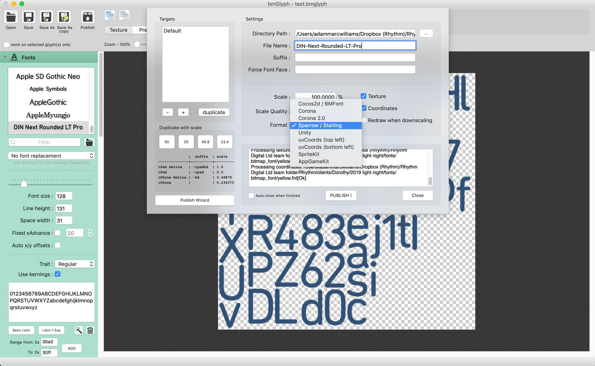

Here is the best workflow I have found for generating bitmap fonts and using them in PIXI.js v5.

## Creating a Bitmap Font

A bitmap font is made up of two files, a .fnt file and a .png.

The .fnt file contains all the information about the font and the coordinates of each character in the accompanying .png, which is like a spritesheet for the font.

I found the easiest way of generating the font was using a program called bmGlyph for the Mac.


bmGlyph is not a free piece of software but the license fee is only £10 and after trying a couple of free ones that lacked certain export options or simply failed entierly, I decided it was definitely worth the investment.

It's important when publishing your Bitmap Font that you set the format to Sparrow/Starling to use it with Pixi.



## Loading the Font

We don't need to add the .png file to our PIXI.Loader as this will be automatically brought in when loading the .fnt file.

```javascript
const loader = new PIXI.Loader()
loader.add('HeadingFont', '/fonts/DIN-Next-Rounded-LT-Pro.fnt').load(() => {
  // Once font has been loaded, call a function that uses it
  createText()
})
```

By default it will look for the .png file in the same folder as the .fnt file but you could change this if you wished by updating the page file path in the .fnt file.

```xml
...
  <pages>
    <page id='0' file='DIN-Next-Rounded-LT-Pro.png'/>
  </pages>
...
```

## Using the Font

When we define the font, we use the name from the `face` attribute in the .fnt file, _NOT_ the name `HeadingFont` we set in our PIXI.Loader.

```javascript
function createText() {
  const text = new PIXI.BitmapText('Hello Bitmap Font', {
    font: '72px DIN-Next-Rounded-LT-Pro',
    align: 'center',
  })
  text.anchor.set(0.5)
  text.position.x = window.innerWidth / 2
  text.position.y = window.innerHeight / 2
  stage.addChild(text)
}
```

## Making the Text Look Good

When I first got my text working, it looked awful.

I realised this was because I forgot to set a resolution for my `PIXI.Renderer` and I was viewing it on a 5K retina display, so I set it using `window.devicePixelRatio`.

```javascript
const renderer = new PIXI.Renderer({
  width: window.innerWidth,
  height: window.innerHeight,
  view: canvasEL,
  antialias: true,
  backgroundColor: 0xfff200,
  resolution: window.devicePixelRatio,
})
```

When I did this though I still had blurry text but it was now spilling out of the page too.


This was because I had doubled the size of the renderer and the canvas had grown to fit it.

To fix this I needed to add `width: 100%; height: 100%;` to the canvas element's styling as just setting the width and height attribute on the renderer/canvas doesn't keep it contained.


For more informaton on BitmapText in PIXI v5, you can read the docs for [PIXI.BitmapText]('http://pixijs.download/dev/docs/PIXI.BitmapText.html')
